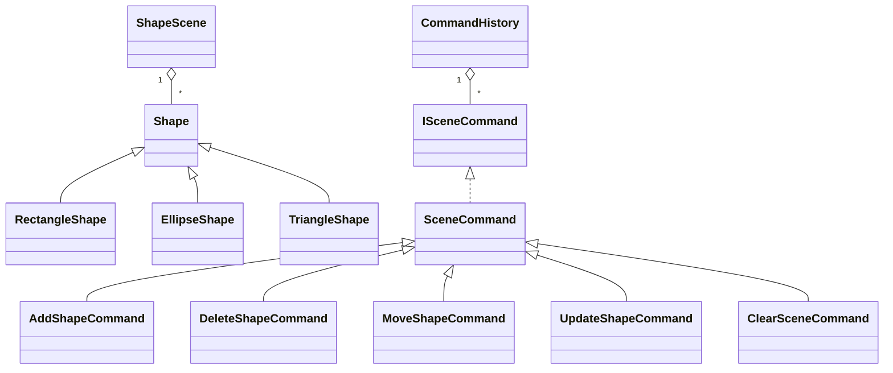

# Задание за курсова работа по ООП

## Тема

Приложение за работа с графични фигури чрез Windows Forms.

## Функционални изисквания

Потребителят може да създава, избира, премества, редактира и изтрива графични фигури върху сцена. Поддържат се три вида фигури: правоъгълник, елипса и триъгълник. За всяка фигура могат да се променят позиция, размери, цвят на запълване, цвят на контур, име и видимост. Приложението изчислява лице на фигурите, показва статистики за сцената и позволява запис/зареждане във файл чрез JSON сериализация.

## Покритие на изискванията

- Етап 1: `ShapeLibrary` съдържа йерархия `Shape`, `RectangleShape`, `EllipseShape`, `TriangleShape`, капсулирани свойства, виртуални методи, полиморфна колекция в `ShapeScene`, различни модификатори за достъп, свойства, делегати и събития чрез `ShapeScene.Changed` и `ISceneCommand.Executed`.
- Етап 2: Windows Forms интерфейсът предоставя сцена, команди за създаване/редакция/изтриване, диалози за цветове, свойства, запис и зареждане. Рисуването използва `System.Drawing` само в UI слоя. Операциите са реализирани чрез йерархия от команди в `ShapeLibrary.Commands`, а `CommandHistory` поддържа Undo/Redo.
- Етап 3: `SceneSerializer` записва и зарежда сцената чрез сериализация. `ShapeScene` използва LINQ за броене, групиране, филтриране, сортиране, сумиране и средни стойности. Преизползваемата логика е отделена в библиотеката `ShapeLibrary`, която няма зависимост към Windows Forms или `System.Drawing`.

## Основна йерархия

