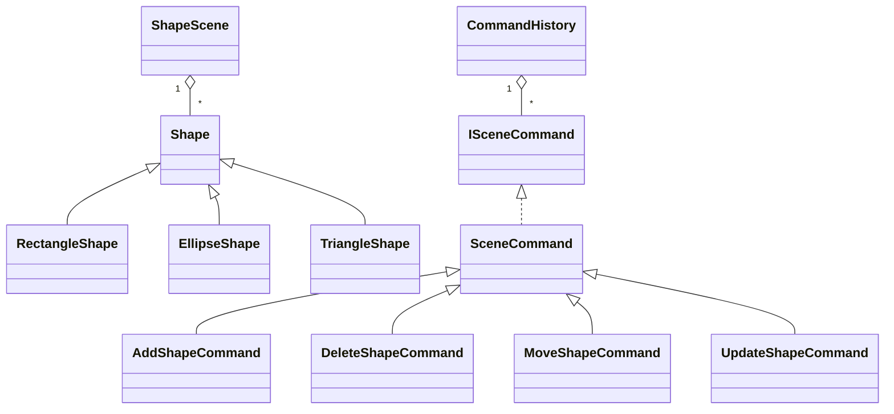

# OOP Coursework Description

## Topic

Windows Forms application for working with graphical shapes.

## Functional Requirements

The user can create, select, move, edit, and delete shapes on a scene. The application supports three shape types: rectangle, ellipse, and triangle. Each shape has position, size, fill color, border color, visibility, drawing behavior, hit-testing behavior, and area calculation. The scene can be saved to and loaded from a file through serialization.

## Requirement Coverage

- Stage 1: `ShapeLibrary` contains the class hierarchy `Shape`, `RectangleShape`, `EllipseShape`, and `TriangleShape`; encapsulated state; properties; virtual methods; polymorphic work through `ShapeScene`; public/private access modifiers; delegates and events through `ShapeScene.Changed` and `ISceneCommand.Executed`.
- Stage 2: The Windows Forms interface provides a scene, shape creation commands, editing, deletion, save/load dialogs, and mouse selection/movement. `System.Drawing` is used only in the UI drawing layer. UI operations are implemented as commands in `ShapeLibrary.Commands`, and `CommandHistory` provides Undo/Redo.
- Stage 3: `SceneSerializer` saves and loads the scene through JSON serialization. `ShapeScene` uses LINQ operations for filtering visible shapes, counting, grouping by type, sorting by area, summing total area, and selecting DTOs for serialization. The reusable project logic is separated in `ShapeLibrary`, which has no dependency on Windows Forms or `System.Drawing`.

## Main Hierarchy

